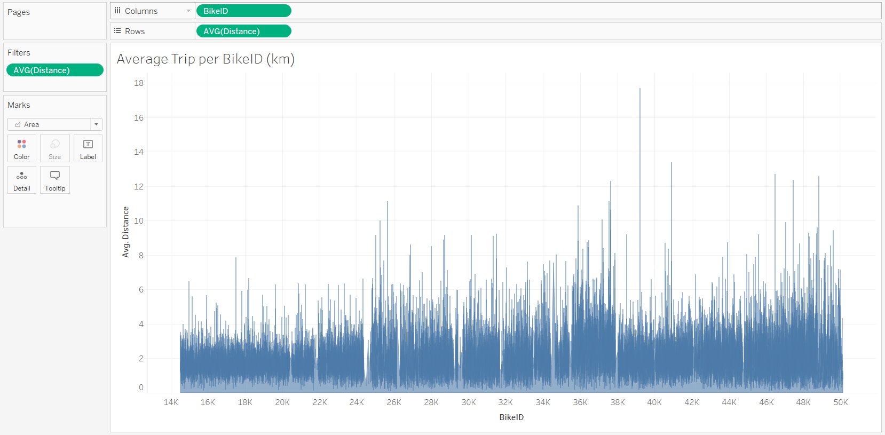
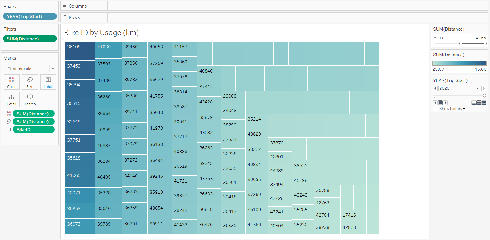

# Citi Bike Analysis (Randomized Samples)

## Objective ##
To analyze the Citi Bike usage data in New York City from 2015 and 2020 to observe any noticable trends in the data.

**Data Preprocessing:**
* Data is extracted from CSV files downloaded from [Citi Bike](https://citibikenyc.com/system-data)'s System Database for [2015](https://s3.amazonaws.com/tripdata/2015-citibike-tripdata.zip) and [2020](https://s3.amazonaws.com/tripdata/2020-citibike-tripdata.zip). (csv's should be placed in the resources folder)
* `random_select.py` was created to process any csv files present in the `Resources` folder.
* Data was randomly sampled to meet the file size requirements of Tableau Public software (currently set to 1,000,000 data points).
* Trip time was provided in seconds and then converted into minutes to make the data more suitable for creation of visualizations.
* Distance was calculated using the longitude and latitude data and then calling the function `DISTANCE` to calculate the distance of each bike ride in kilometers.

## Main Dashboard ##
All the longitude and latitude data was used to call the function `makepoint` so that each bike ride could be traced using `makeline`. Data was then grouped by the start station name so that all the routes radiated out of a singular point like a flower. This helps give an idea of the route and final destination points.

## Bike Usage Trends by Month ##
The data was arranged by month to show the general trend of usage during the year. Bike usage is up 2x overall but non-subscriber usage is up almost 5x during peak months. This shows that there is a group of customers that may only rent a bike out of necessity instead of regular use. There is still an opportunity to capitalize on converting these non-subscribers.

## User Breakdown ##
Subscribers used the service over three times more than normal customers. However, the data suggests that subscribers used the service more frequently but for shorter trips compared to normal users.

## Start/End Stations ##
The start and end stations were grouped by their count in the dataset. The most popular start stations tend to be near areas where subway stations are too far away to reach by walking. End stations show a similar trend as they are often in the outskirts of the city away form any nearby subway stations. 

The stations were then color coded and sized according be their rank in the dataset. Filters were added to show include/exclude each month. In the summer, there is a heavier concentration of start stations near the coasts suggesting people tend to frequent the piers more often (possibly due to cooler climate). End station data also shows similar trends as the start station. There is additional evidence that bikes are being rented to cross the major bridges in the city as there is a heavier concentration of end points outside the city.

## Average Bike Trip Distance ##
The average distance traveled per bike trip is concentrated around 2km.

# Bikes Likely to be Repaired ##
The dataset was then sorted by total distance traveled for the year and then filtered to show the bikes that have been used for 3km or more. These are most likely to need repair in the future. Most bikes traveled 1.5km or less.

